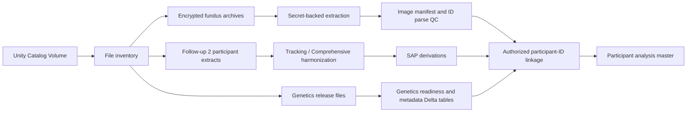

# CLSA retinal-aging data extraction master guide

This repository provides a Databricks-oriented pipeline for inventorying and
extracting fundus images, harmonizing the retinal-aging variables specified in
the SAP, selecting key Follow-up 2 questionnaire data, and linking phenotype
records to CLSA genome-wide genetic metadata.

The pipeline is designed for:

`/Volumes/ophthalmology_analytics/dev_optic/clsa_dataset`

It writes derived data under:

`/Volumes/ophthalmology_analytics/dev_optic/clsa_dataset/derived/clsa_retinal_aging`

The pipeline does **not** assume that filenames are participant identifiers, that
Tracking and Comprehensive participants are the same cohort, or that a genotype
row can be joined to a questionnaire row by order. Those assumptions would
create silent linkage errors.

## Contents

- `config/clsa_pipeline_config.json`: Volume paths, discovery regular
  expressions, filename parsing rules, secret names, and analysis gates.
- `config/variable_manifest.csv`: auditable mapping from SAP concepts to
  Tracking, Comprehensive, and baseline CLSA variable names.
- `src/clsa_pipeline.py`: reusable extraction, harmonization, derivation,
  genetics-readiness, and Delta-output functions.
- `notebooks/01_build_clsa_dataset.py`: Databricks notebook source and the main
  orchestration entry point.
- `src/fundus_retfound_pipeline.py`: fundus technical quality checks,
  AutoMorph-style preprocessing, RETFound embeddings, retinal-age modeling, and
  explainability.
- `notebooks/02_run_fundus_retfound.py`: thin Databricks caller for debugging
  each image/model stage independently.
- `RUN_RETFOUND.md`: exact GPU setup, smoke-test, full-run, age-head, and
  explainability instructions.
- `requirements-databricks.txt`: small Python dependencies used for the
  dictionary and optional image metadata.

## What the supplied sources establish

### Retinal-aging SAP

The Word document, *CLSA retinal aging SAP[17].docx*, is a five-page selected
variable codebook. It specifies the following core derivations:

- Self-reported visual impairment: `VIS_SGHT_*` equal to 4 (fair) or 5
  (poor/blind).
- Better-seeing-eye acuity: the lesser of left- and right-eye values, after
  removing missing sentinels. The SAP then uses a 0.3 threshold.
- Depression: CES-D 10 score greater than or equal to 10.
- Married/partnered: marital-status code 2.
- Arthritis: any of hand, hip, or knee osteoarthritis.
- Asthma/lung disease: asthma or COPD.
- Social activity: each activity is frequent for codes 1-2 and infrequent for
  codes 3-5; an overall indicator is positive when any activity is frequent.
- Yes/no chronic-condition variables: 1 is yes, 2 is no, and missing/refused
  codes are null.

The SAP leaves frailty and epigenetic age blank. It also describes a
32-condition multimorbidity measure without supplying a complete 32-variable
code list. This pipeline therefore produces
`multimorbidity_selected_count` only from the conditions explicitly mapped in
the supplied table. It does not mislabel that result as the official
32-condition score.

### Follow-up 2 dictionary workbook

The supplied workbook contains metadata, not participant data:

- `Variables`: 5,220 rows and 9 columns.
- `Categories`: 26,270 rows and 7 columns.
- 1,795 variable rows belong to `Tracking_FUP2_v2-1`.
- 3,410 variable rows belong to `Comprehensive_FUP2_v4`.

Tracking variables generally end in `_TRF2`, while Comprehensive variables
generally end in `_COF2`. These are separate CLSA cohorts and are harmonized
then appended with a `cohort` field; they are not joined to one another.

Important dictionary findings:

- Follow-up 2 self-reported vision is `VIS_SGHT_TRF2` or `VIS_SGHT_COF2`.
- Follow-up 2 comprehensive acuity is `VA_R_SCORE_COF2` and
  `VA_L_SCORE_COF2`, not the baseline `VA_ETDRS_*` names.
- The dictionary does not provide a unit or state that the Follow-up 2 acuity
  scores are logMAR. `visual_impairment_acuity` remains null until the
  `visual_acuity_scale_confirmed_logmar` gate is deliberately enabled.
- The English label for `VA_L_SCORE_COF2` says left eye, but its French label
  says both eyes. The pipeline trusts the variable name and English label and
  records the discrepancy for data-steward review.
- `ED_UDR04_COM` has no Follow-up 2 attainment equivalent in this workbook.
  Baseline education must be linked separately.
- Follow-up 2 income is a five-band categorical variable. It is retained as
  `household_income_band`; it is not called a quartile.
- Follow-up 2 sampling strata is `WGHTS_GEOSTRATA_TRF2` or
  `WGHTS_GEOSTRATA_COF2` (plural `GEOSTRATA`), correcting the SAP spelling.
- No epigenetic-age, methylation, `ADM_GWAS_COM`, or PSU variable is defined in
  the workbook.

### Genome-wide genetics PDF

The genome-wide genetic release contains 26,622 successfully genotyped
participants, 794,409 directly genotyped markers, and approximately 308 million
TOPMed-imputed variants.

Key technical facts from the PDF:

- Directly genotyped data are PLINK BED/BIM/FAM.
- Directly genotyped coordinates are GRCh37/hg19.
- Imputed BGEN coordinates are GRCh38/hg38.
- Imputed files cover chromosomes 1-22 and chromosome 23 (X).
- `clsa_imp_v3.sample` lists imputed samples.
- The IID in `clsa_gen_v3.fam` and ID 1 in `clsa_imp_v3.sample` correspond to
  `ADM_GWAS_COM`.
- `ADM_GWAS_COM` links genetics to a project-specific CLSA participant
  identifier. The authorized crosswalk is still required.
- `clsa_sqc_v3.txt` contains batch, reported/chromosomal sex, ancestry cluster,
  kinship, heterozygosity/missingness flags, and principal components.
- `clsa_mqc_v3.txt` contains marker-level failure counts and low-frequency/indel
  flags.
- `clsa_rel_v3.txt` contains related pairs and KING kinship information.
- `clsa_hla_v3.csv` contains HLA allele calls and probabilities.
- BGEN stores dosage after conversion from VCF; original genotype probabilities
  cannot be reconstructed losslessly from the supplied BGEN.

### Current genetics upload limitation

The supplied upload README records that 24 large genotype files, totaling
191.5 GiB uncompressed, were intentionally excluded:

- `clsa_gen_v3.bed` is absent.
- `clsa_imp_1_v3.bgen` through `clsa_imp_23_v3.bgen` are absent.

The BIM, FAM, BGEN indexes, sample file, MFI files, QC files, relationship file,
HLA file, MD5 manifest, and release PDF were uploaded. A `.bgen.bgi` index is not
usable without its matching `.bgen`, and BIM/FAM are not a genotype dataset
without BED. The notebook reports these conditions as `direct_ready=false` and
`imputed_ready=false` until the missing files are staged and verified.

## Pipeline architecture



The final participant table stores image paths and metadata, not duplicate image
bytes. Raw genotypes remain in PLINK/BGEN files and are analyzed with genetics
software rather than expanded into an unmanageable Spark-wide table.

## Databricks setup

### 1. Put the password in a Databricks secret

Do not paste the supplied fundus password into the notebook, JSON configuration,
shell history, a Delta table, or Git.

Create a secret scope named `clsa` and a secret named
`fundus-archive-password` using your workspace-approved secret-management
method. Enter the value interactively. The configuration stores only the scope
and key names.

Grant the job service principal or user read permission on that secret and the
minimum required permissions on the source and derived Volume directories.

### 2. Install notebook dependencies

On a Databricks cluster:

```python
%pip install -r /Workspace/Repos/<user>/<repo>/requirements-databricks.txt
dbutils.library.restartPython()
```

`openpyxl` reads the dictionary workbook. Pillow is used only when optional
image-dimension probing is enabled. The default manifest pass does not open
image pixels.

### 3. Sync the repository

Place this repository in a Databricks Repo or Workspace Files location and set
the notebook `repo_root` widget to that absolute Workspace path.

### 4. Confirm Volume contents

Run the notebook once with:

- `extract_fundus_archives=false`
- `build_questionnaire=false`
- `image_root` blank
- the participant data paths blank if they are not yet known

The first phase writes `file_inventory` and prints candidate dictionary,
Tracking, Comprehensive, fundus-archive, sample-QC, and HLA paths. Review those
results before enabling extraction.

## Required inputs that are not in the dictionary workbook

The dictionary defines columns but has no participant rows. Supply at least one
participant-level data extract:

- Tracking Follow-up 2: CSV/CSV.GZ, Parquet, or Delta.
- Comprehensive Follow-up 2: CSV/CSV.GZ, Parquet, or Delta.

If the supplied participant data are SAS, SPSS, or another format, convert them
once to Parquet or Delta using an approved reader and preserve the original file
as immutable source data.

The pipeline also requires the project-specific participant identifier column.
Update `participant_id_candidates` in the configuration if its released name
is not already listed. Do not use row numbers as identifiers.

## Run order

### Phase A: Inventory

Run `notebooks/01_build_clsa_dataset.py`. It writes:

- `file_inventory`
- a JSON genetics-readiness summary
- candidate path lists

The inventory is metadata-only; it does not load image or genotype contents.

### Phase B: Fundus extraction

After confirming the archive candidates:

1. Set `extract_fundus_archives=true`.
2. Confirm the secret scope/key.
3. Run the extraction phase.
4. Inspect `fundus_extraction_manifest`.
5. Inspect the count of unparsed participant IDs in
   `fundus_image_manifest`.

The built-in extractor supports standard ZipCrypto ZIP archives and blocks
path-traversal members. If the archive uses WinZip AES or is a 7z archive, use a
workspace-approved AES-capable extractor that can receive the password without
placing it on a process command line. Do not weaken encryption or log the
password.

Before linkage, edit `participant_id_regex` and `eye_regex` to match the actual
archive naming convention. The defaults are only discovery rules. All unparsed
or ambiguous names must be resolved or explicitly excluded with a reason.

### Phase C: Follow-up 2 metrics

Set `tracking_data_path` and/or `comprehensive_data_path`, then run the
harmonization section with `build_questionnaire=true`.

The pipeline:

1. Resolves the project-specific participant ID.
2. Selects source columns from `variable_manifest.csv`.
3. Standardizes both cohorts to one schema.
4. Appends them with `cohort=tracking|comprehensive`.
5. Applies missing-code cleanup.
6. Derives the SAP variables.
7. Writes `variable_mapping_audit` and
   `questionnaire_retinal_metrics`.

The mapping audit is a required review artifact. Any `missing` source column
should be explained as cohort-specific unavailability or corrected in the
manifest.

### Phase D: Authorized linkage

Provide a crosswalk with exactly one row per project-specific participant ID and
the corresponding `ADM_GWAS_COM`.

Required logical columns:

- `participant_id`
- `ADM_GWAS_COM`

The widget names can be changed if the physical columns differ. The notebook
rejects duplicate participant rows. It does not infer genetic linkage from file
order, FAM position, sample position, age, sex, or image filenames.

The image identifier must also be checked against the same project-specific
participant ID. If images carry another release-specific ID, add an authorized
image crosswalk before the image aggregation step.

## Derived phenotype definitions

| Output | Definition |
|---|---|
| `visual_impairment_self_report` | 1 for vision codes 4-5; 0 for 1-3 |
| `visual_acuity_better_eye` | Lesser of clean left/right values; both eyes required by default |
| `visual_impairment_acuity` | Greater than 0.3 only when the logMAR scale gate is enabled |
| `depression_cesd10` | 1 when CES-D 10 is at least 10 |
| `married_or_partnered` | 1 for marital-status code 2 |
| `arthritis_any` | Any positive hand, hip, or knee osteoarthritis |
| `asthma_or_copd` | Asthma or COPD/chronic lung disease |
| `social_*_at_least_weekly` | 1 for original codes 1-2; 0 for codes 3-5 |
| `social_any_at_least_weekly` | Any social domain at least weekly |
| `multimorbidity_selected_count` | Sum of the mapped conditions; not the official 32-condition score |

Confirmed-prior-wave code 11 is treated as yes for applicable chronic
conditions. Workbook-defined missing, refusal, skip, no-DCS, COVID-restriction,
and inconclusive codes are converted to null before derivation.

### Measures deliberately not auto-derived

- **Frailty:** choose a validated CLSA phenotype and publish its item list,
  missing-item rule, direction, and cut points.
- **Epigenetic age:** requires methylation data, preprocessing, clock choice,
  cell-composition handling, and a definition such as age acceleration residual.
  SNP genotypes alone do not provide epigenetic age.
- **Education attainment:** join the baseline `ED_UDR04_COM` release or a
  steward-approved harmonized replacement.
- **Income quartile:** Follow-up 2 provides bands. A within-sample `ntile(4)`
  would not reproduce population income quartiles and is not performed.
- **Official multimorbidity count:** add the complete 32-condition manifest
  before naming any variable the CLSA 32-condition count.
- **Survey PSU:** obtain the released survey-design specification. A participant
  ID is not automatically a valid PSU merely because the SAP mentions a unique
  ID.
- **Retinal age prediction:** the attachments specify covariates but no trained
  image model, preprocessing recipe, or model weights. This pipeline extracts
  and links images; retinal-age inference is a separate validated model stage.

## Genetics workflow

### 1. Restore missing genotype payloads

From the original `Genomics3_clsa.zip`, stage:

- `clsa_gen_v3.bed`
- `clsa_imp_1_v3.bgen` through `clsa_imp_23_v3.bgen`

Keep filenames unchanged so they match the uploaded BIM/FAM and BGI/sample
files. Use an approved high-throughput transfer route and verify every file
against `clsa_v3.md5`. The notebook should report:

- `direct_ready=true`
- no missing BGEN chromosomes
- no missing BGI chromosomes
- `imputed_ready=true`

Do not begin association analysis when only indexes or metadata are present.

### 2. Ingest metadata to Delta

The notebook ingests:

- `clsa_sqc_v3.txt` to `genetics_sample_qc`
- `clsa_hla_v3.csv` to `genetics_hla`

Keep `clsa_mqc_v3.txt`, `clsa_rel_v3.txt`, and chromosome MFI files available for
marker QC, relatedness handling, and imputation-quality filters. Their size is
small compared with genotype payloads and they can be converted to Delta in a
separate genetics job.

### 3. Define the analysis sample

At minimum, document decisions for:

- Samples flagged by `in.hetmiss`.
- Related participants (`in.kinship` and `clsa_rel_v3.txt`).
- Reported versus chromosomal sex discrepancies.
- Full-cohort versus ancestry-specific analysis.
- Batch.
- Principal components.
- Consent/release restrictions in the project-specific crosswalk.

The PDF identifies PCA cluster 4 as the CLSA European-ancestry subset. Use it
only when that ancestry restriction matches the scientific question; do not
silently exclude other ancestries.

### 4. Define marker filters

For directly genotyped markers, consider the release marker-QC fields:

- `batch_disc`
- `hwe_disc`
- `ctl_disc`
- `sex_disc`
- `low_freq`
- `indel`

For imputed variants, use chromosome MFI files and pre-specify an Rsq and allele
frequency threshold appropriate to the analysis. The release provides two
batch-specific frequency/Rsq pairs, so confirm how the planned software
combines or filters them.

### 5. Use genetics-native tools

Use PLINK 2 for BED and compatible BGEN operations, and use BGEN-aware tools
such as bgenix/qctool or an approved GWAS engine such as REGENIE/SAIGE. Hail is
also suitable when installed and governed in the Databricks environment.

Illustrative direct-genotype extraction:

```bash
plink2 \
  --bfile /Volumes/ophthalmology_analytics/dev_optic/clsa_dataset/<genomics-path>/clsa_gen_v3 \
  --keep approved_samples.txt \
  --extract approved_markers.txt \
  --make-pgen \
  --out /local_disk0/clsa_analysis
```

Illustrative imputed-region inspection:

```bash
bgenix \
  -g /Volumes/ophthalmology_analytics/dev_optic/clsa_dataset/<genomics-path>/clsa_imp_1_v3.bgen \
  -incl-range 1:1000000-2000000
```

Replace placeholders and run heavy genetics workloads from local NVMe scratch
when the tool cannot efficiently stream Unity Catalog Volume files. Copy only
the required chromosome/region, verify the copy, and delete governed scratch
data at job completion.

### 6. Respect genome builds

Direct genotypes are GRCh37; imputed genotypes are GRCh38. Record genome build
in every variant table and result file. Do not join variants by chromosome and
position across these sources without validated liftover and allele checks.

## Output tables

| Delta path under `output_root` | Grain |
|---|---|
| `file_inventory` | One row per source/derived file at inventory time |
| `fundus_extraction_manifest` | One row per extracted archive member |
| `fundus_image_manifest` | One row per image |
| `dictionary_variables` | One row per dictionary variable |
| `dictionary_categories` | One row per category/code |
| `dictionary_missing_codes` | One row per variable-specific missing code |
| `variable_mapping_audit` | One row per cohort and standardized variable |
| `questionnaire_retinal_metrics` | One row per participant per cohort |
| `genetics_sample_qc` | One row per genetic sample |
| `genetics_hla` | One row per participant/locus call |
| `participant_analysis_master` | One row per participant per cohort |

The participant master includes `has_fundus_image`, `has_genetics_link`, and a
minimal `analysis_complete_case` indicator. That last indicator is a pipeline
readiness flag, not the final statistical complete-case definition.

## Required quality-control checks

### Files and extraction

- Source files are immutable.
- Archive members cannot escape the target directory.
- Extraction manifest count and sizes reconcile to the archive.
- No password appears in notebook output, cluster logs, Git, or Delta.
- Image count, extensions, and byte totals are plausible.
- Every unparsed image identifier has a documented resolution.
- Laterality is reviewed; `R`, `L`, `OD`, and `OS` are not assumed without
  checking the naming convention.

### Questionnaire

- One row per released participant within each cohort.
- Participant IDs are non-null and unique within cohort.
- Mapping-audit missing fields are understood.
- Missing-code cleanup matches the `Categories` sheet.
- CES-D 10 and chronic-condition distributions are plausible.
- Tracking and Comprehensive results are summarized separately before pooling.
- Survey weights and strata remain cohort-specific.

### Linkage

- Crosswalk is one-to-one for participant-to-`ADM_GWAS_COM`.
- Image crosswalk is many-images-to-one-participant as expected.
- FAM/sample/SQC genetic IDs agree after string normalization.
- Join rates are reported separately for images, genetics, and phenotypes.
- Nonmatches are retained in an exception table; they are not silently dropped.

### Genetics

- MD5 validation passes after restoring BED/BGEN.
- BED/BIM/FAM basename triplet is complete.
- Every BGEN has its matching BGI and the shared sample file.
- Genome build is explicit.
- Sample and marker exclusions are versioned.
- Relatedness, ancestry, batch, sex, and PCs are handled by a pre-specified
  analysis plan.
- No raw genotype export leaves the governed environment.

## Reproducibility and governance

- Pin the repository commit used for each run.
- Save the widget values, configuration hash, input inventory snapshot, and
  output Delta versions.
- Store project-specific crosswalks in a restricted Volume path, not in Git.
- Use Unity Catalog grants to separate raw, crosswalk, derived, and export
  access.
- Avoid including direct identifiers in analytic exports.
- Treat image paths, genotype IDs, and crosswalks as sensitive even when image
  pixels or genotype dosages are not embedded in the table.
- Publish an analysis-specific data dictionary containing standardized names,
  source variables, derivations, missingness rules, genome build, and exclusions.

## Source documents used

- *CLSA retinal aging SAP[17].docx* - retinal-aging metric definitions.
- *follow-up2_data_dictionaries_tracking_and_comprehensive_v2.xlsx* - Follow-up
  2 variable and category metadata.
- *clsa_gwas_v3.pdf* - CLSA genome-wide release formats, identifiers, QC, PCA,
  relatedness, and imputation details.
- *README (2).md* - exact genotype payloads excluded from the Volume upload.

These sources are sufficient to build the extraction and linkage framework.
They are not sufficient to finalize frailty, epigenetic age, the official
32-condition multimorbidity score, survey PSU, the Follow-up 2 acuity scale, or
a retinal-age image model. Those items must be resolved and versioned before
confirmatory analysis.
